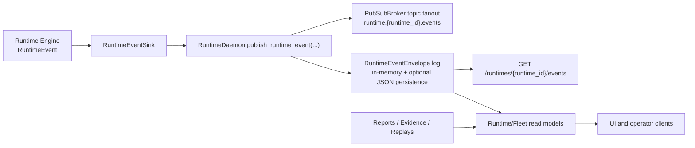

# Runtime Event Topology

This page defines the current runtime event topology and the intended migration path from local in-process pub/sub to a durable external transport.

It is the architecture reference for runtime event boundaries. Implementation details still live in runtime daemon and runtime engine modules.

## Current Topology

## Topic Model

The runtime topic names are currently:

| Topic | Purpose | Payload |
| --- | --- | --- |
| `runtime.{runtime_id}.events` | Runtime event fanout for local subscribers | `RuntimeEvent.to_dict()` |
| `runtime.{runtime_id}.control.requests` | Reserved command ingress topic | `RuntimeControlCommand.to_dict()` |
| `runtime.{runtime_id}.control.responses` | Command result fanout | `RuntimeControlResponse.to_dict()` |

Control command handling is currently invoked through `RuntimePubSubGateway.handle_command(...)` and publishes to `control.responses`. The `control.requests` topic name is defined for transport parity and staged migration, but is not yet wired as an automatic consumer loop.

## Daemon, Events, and Read-Model Relationship

### Event publication path

1. Runtime code emits `RuntimeEvent` values through a `RuntimeEventSink`.
2. `RuntimeDaemon.runtime_event_sink(runtime_id)` returns a buffered sink that forwards to `RuntimeDaemon.publish_runtime_event(...)`.
3. `publish_runtime_event(...)` publishes event payloads to `runtime.{runtime_id}.events`.
4. The daemon then appends a `RuntimeEventEnvelope` with:
   - `sequence` (monotonic per runtime, daemon-scoped)
   - `event_id` (defaults to `{runtime_id}:{sequence}` when omitted)
   - `published_at`
   - embedded `event`
5. If `storage_dir` is configured, envelopes persist as JSON under `events/<runtime_id>.json`.

### Event query and pagination path

- `GET /runtimes/{runtime_id}/events` returns a `RuntimeEventPage`.
- Supported filters: `after`, `limit`, `family`, `name`, `strategy_id`, `execution_id`, `route_id`, `broker_id`.
- Response carries `events`, `next_after_sequence`, and `has_more`.

### Read-model path

- `GET /runtimes/{runtime_id}/read-models/{view}` reads host-backed runtime models when the runtime host exists.
- If the runtime host is absent, or the requested runtime view is unknown, the daemon falls back to report-oriented read models.
- `GET /runtimes/{runtime_id}/report-models/{view}` always resolves through report-oriented models (`opportunities`, `reports`, `replays`, `evidence`, governed/research/scan variants).
- `GET /fleet/read-models/{view}` exposes fleet-level projections.

## Replay and Report Surface

Replay, report, and evidence data are daemon-managed records that feed report read models. They are related to runtime events but are separate contract families:

- Runtime event timeline: `RuntimeEventEnvelope`
- Report records: `RuntimeReportRecord`
- Replay records: `RuntimeReplayEnvelope`
- Evidence records: `RuntimeEvidenceEnvelope`

This separation should remain intact when transport evolves.

## Local Mode Constraints

The current in-process broker is intentionally minimal:

- same-process only
- no broker durability for subscriptions
- no consumer offsets or replay from the pub/sub layer
- no acknowledgement protocol
- no backpressure controls

Durability today is provided by daemon-managed event/report/evidence/replay stores (optional JSON persistence), not by the pub/sub broker itself.

## Upgrade Triggers Beyond Local Mode

Move beyond in-process pub/sub when one or more of these become true:

1. Event consumers must survive daemon restarts without losing stream position.
2. Multiple processes/services need the same event stream concurrently.
3. Command traffic requires queue semantics, retries, or dead-letter handling.
4. Operator workloads require explicit consumer lag/backpressure observability.
5. Throughput or fanout growth makes in-process synchronous handlers unsafe.

## Staged Migration Path

### Stage 1: Transport Interface Hardening

- Keep `RuntimeEvent`, `RuntimeEventEnvelope`, command/response payload shapes, and topic naming stable.
- Introduce a broker abstraction that mirrors current topic methods.
- Keep daemon HTTP read models as transport-agnostic surfaces.

### Stage 2: Shadow External Bus

- Dual-publish runtime events to local broker and external transport.
- Continue serving `GET /runtimes/{runtime_id}/events` from daemon event log.
- Validate parity by comparing sequence/event_id coverage across both paths.

### Stage 3: External Control-Plane Routing

- Route control requests through `runtime.{runtime_id}.control.requests` on external transport.
- Preserve response contract on `control.responses`.
- Enforce command idempotency keyed by `command_id`.

### Stage 4: Durable Consumer Positioning

- Introduce durable consumer offsets/checkpoints per consumer group.
- Keep runtime-scoped ordering as the baseline (`runtime_id` remains partition key).
- Maintain daemon read-model and API contracts while internals shift to external transport cursors.

## Migration Invariants

Transport work should not break these boundaries:

1. Runtime-scoped topic partitioning by `runtime_id`.
2. Existing daemon HTTP contract shapes for events and read models.
3. Report/replay/evidence contract separation from raw runtime events.
4. Runtime identity attribution fields (`strategy_id`, `execution_id`, `route_id`, `broker_id`).
