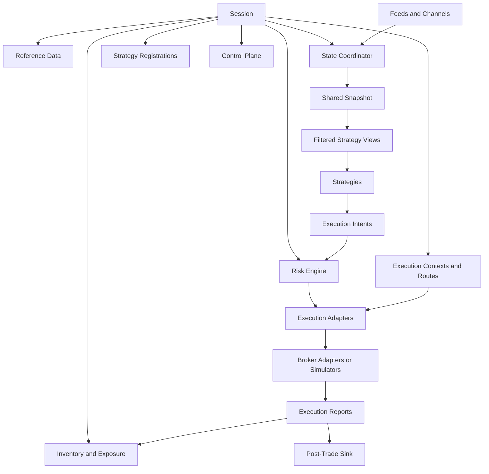

# Runtime Map

This is the primary architecture map for Cracktrader.

It describes the current runtime direction and the ownership boundaries that the codebase is converging on. It intentionally replaces the older "Cerebro plus feeds plus brokers" mental model as the default explanation.

## Runtime Shape

## Preferred Mental Model

Think about Cracktrader in this order:

1. A session owns the shared runtime surfaces.
2. Market inputs update a central state coordinator.
3. The runtime materializes one immutable snapshot for the active graph.
4. Strategies receive filtered views of that snapshot.
5. Strategies emit attributed intents against named execution contexts and routes.
6. Risk and execution layers evaluate those intents before submission.
7. Inventory, exposure, and post-trade hooks consume the resulting execution reports.

## Ownership Boundaries

### Session

The session is the ergonomic owner for runtime construction.

It should be the first place you look for:

- reference-data ownership
- state registration
- strategy registration
- route and execution-context registration
- default inventory and control-plane surfaces

### Reference Data

Reference data normalizes instruments and venue metadata.

It is the source of truth for:

- canonical symbols
- venue-native symbol mapping
- tick and lot constraints
- minimum size and notional checks
- validation metadata reused by execution, simulation, and risk

### State Coordinator

The state coordinator owns the active shared graph.

It is responsible for:

- observed state ingestion
- reusable feature and projection computation
- snapshot materialization
- deterministic shared-step behavior

### Strategy Orchestration

Strategies are consumers of shared state, not owners of it.

The orchestration layer is responsible for:

- multi-strategy registration
- filtered snapshot fanout
- per-strategy attribution
- strategy-local outputs remaining isolated from each other

### Execution Contexts and Routes

Execution contexts describe where a strategy may send intents.

Routes provide:

- stable `route_id` lookup
- broker/account bindings
- mode-specific execution adapter selection
- explicit default-route behavior

### Inventory and Exposure

Inventory is centrally maintained from execution reports.

This layer should answer:

- what positions does the session currently hold
- how much exposure exists by route or execution context
- what fills and order states have already been observed

### Risk Engine

Risk lives between strategy output and execution submission.

It consumes:

- current inventory and exposure
- route and execution metadata
- snapshot freshness and runtime provenance

It produces explicit decisions instead of hidden strategy-side behavior.

### Execution Adapters

Execution mode differences belong behind a stable execution boundary.

The same strategy and route contracts should be able to target:

- live brokers
- paper execution
- backtest simulators

without changing the strategy-facing API.

### Post-Trade and Control Plane

These are runtime edge hooks, not strategy concerns.

- Post-trade sinks capture reports for research, archival, attribution, or TCA.
- Control-plane hooks apply runtime guards such as route enablement or kill-switch decisions.

## Current State vs Legacy Framing

| Topic | Current truth | Legacy framing to treat as compatibility only |
| --- | --- | --- |
| Shared ownership | Session-owned runtime surfaces | Per-feed or per-broker local ownership |
| Strategy execution | Shared snapshot fanout to registered strategies | Single local strategy loop as the only real model |
| Routing | Stable execution contexts and route IDs | Positional broker wiring |
| Inventory and risk | Central runtime services | Mostly broker-local or strategy-local logic |
| Mode differences | Execution adapters behind one boundary | Separate mental models for backtest vs paper vs live |
| Post-trade hooks | First-class runtime boundary | Ad hoc observer side effects |

## What Still Exists for Compatibility

Some older surfaces remain important:

- Backtrader and Cerebro compatibility
- store/feed/broker terminology
- existing core-concepts pages for exchange or broker specifics

Those pages are still useful when you need implementation detail or migration context, but they are no longer the right top-level system map.

## Recommended Reading

After this page:

1. [Architecture Index](agent_index.md)
2. [Mode Matrix](mode_matrix.md)
3. [Runtime Terms](runtime_terms.md)
4. [Legacy Architecture Context](../core_concepts/architecture.md)
