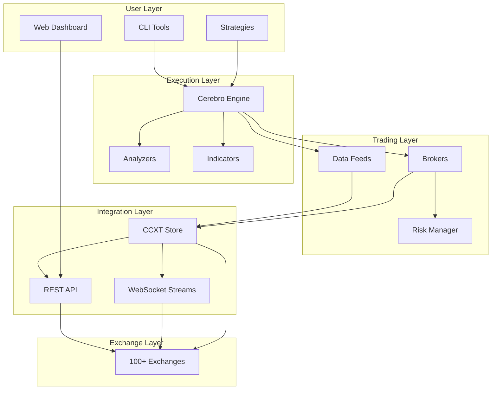
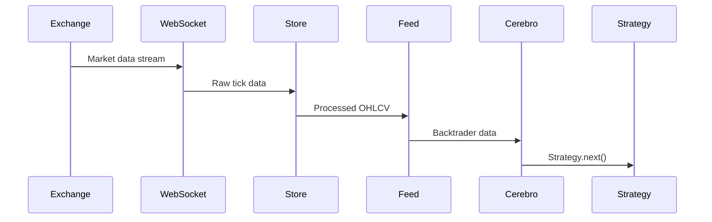
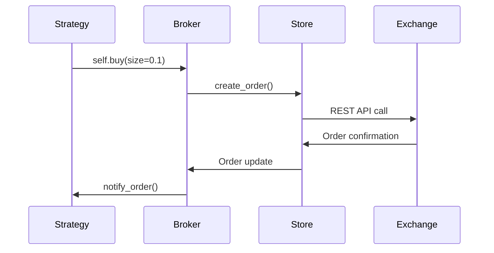

# Architecture Overview

Cracktrader is built for modularity, performance, and reliability. This overview shows how strategies, feeds, brokers, and the CCXT store work together.

## High-Level Architecture



## Core Components

### 1. Cerebro (Execution)

Backtrader’s Cerebro runs your strategy, routes data, and manages the broker.

- Strategy orchestration and lifecycle
- Feed ↔ strategy ↔ broker data flow
- Bar/tick progression and analyzers

```python
cerebro = bt.Cerebro()
cerebro.adddata(data_feed)
cerebro.addstrategy(MyStrategy)
cerebro.setbroker(broker)
cerebro.run()
```

### 2. CCXT Store (Integration)

The CCXTStore centralizes exchange connectivity and shared resources.

- Unified interface to 100+ exchanges
- WebSocket/REST connection management
- Historical data caching
- Built‑in rate limiting

```python
store = CCXTStore(
    exchange='binance',
    sandbox=True,
    cache_enabled=True
)
```

Key features
- Registry/singleton for shared connections
- Async background loop for exchange I/O
- Automatic reconnection and error handling
- Structured logging and diagnostics

### 3. Data Feeds (Market Data)

CCXTDataFeed provides real‑time and historical OHLCV data.

- Timeframes: seconds to monthly
- Live streaming via WebSocket
- Historical backfill for backtests
- Validation and gap detection

```python
feed = CCXTDataFeed(
    store=store,
    symbol='BTC/USDT',
    ccxt_timeframe='1h',
    live=True
)
```

### 4. Brokers (Execution)

Two broker paths cover live and research.

- CCXTLiveBroker: real exchanges, live orders and balances
- CCXTBackBroker: backtesting/paper trading with configurable costs

Paper trading uses the backtesting broker with live feeds (create via `BrokerFactory.create(mode='paper')`).

### 5. Strategies (Trading Logic)

Built on Backtrader's strategy framework with enhancements:

```python
class MyStrategy(bt.Strategy):
    def __init__(self):
        self.sma = bt.indicators.SMA(period=20)

    def next(self):
        if self.data.close > self.sma:
            self.buy(size=0.1)
```

Enhanced features
- OCO bracket orders and risk helpers
- Real‑time monitoring hooks
- Multi‑asset support

## Data Flow Architecture

### 1. Market Data Flow



### 2. Order Execution Flow



## Concurrency Model

Hybrid sync/async design:

- Main thread: strategy execution, indicators, analyzers
- Background loop: exchange I/O (WebSocket/REST), order/balance updates
- Thread‑safe queues and minimal locking between components

```python
# Thread-safe store operations
store = CCXTStore(exchange='binance')
await store.initialize()  # Async initialization

# Sync strategy access
class Strategy(bt.Strategy):
    def next(self):
        # This runs in main thread
        latest_price = self.data.close[0]
```

## Performance

- Caching for historical data (configurable location)
- WebSocket reuse and HTTP session pooling
- Built‑in rate limiting
- Efficient data structures for in‑memory processing

## Reliability

- Automatic reconnection with backoff
- Heartbeats and stream liveness checks
- Data validation and outlier filtering
- Pre‑flight order validation and lifecycle tracking
- **Failure Recovery**: Handle partial fills and rejections

## Configuration Management

### 1. Hierarchical Configuration
```
Environment Variables → Config Files → Code Defaults
```

### 2. Exchange-Specific Settings
```python
config = {
    'binance': {
        'sandbox': True,
        'rate_limit': 1200,  # requests per minute
        'timeout': 30000     # milliseconds
    }
}
```

### 3. Strategy Parameters
```python
class Strategy(bt.Strategy):
    params = (
        ('period', 20),
        ('risk_pct', 0.02),
    )
```

## Monitoring and Observability

### 1. Structured Logging
- **JSON Format**: Machine-readable logs
- **Context Propagation**: Request tracing across components
- **Log Levels**: Configurable verbosity

### 2. Metrics Collection
- **Performance Metrics**: Latency, throughput, error rates
- **Business Metrics**: PnL, win rate, Sharpe ratio
- **System Metrics**: Memory, CPU, network usage

### 3. Health Checks
- **Liveness Probes**: Is the system running?
- **Readiness Probes**: Can it handle requests?
- **Dependency Checks**: Are exchanges reachable?

## Next Steps

- [**Exchanges**](exchanges.md) - Exchange integration details
- [**Data Feeds**](feeds.md) - Market data handling
- [**Brokers**](brokers.md) - Order execution systems
- [**Strategies**](strategies.md) - Trading logic development
