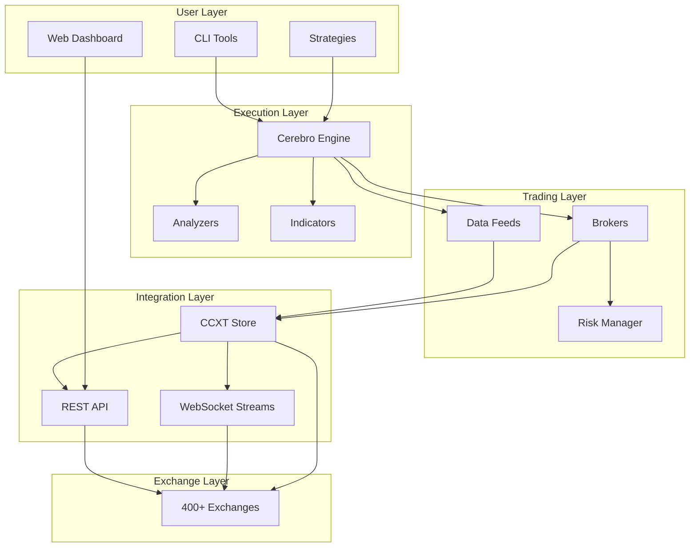
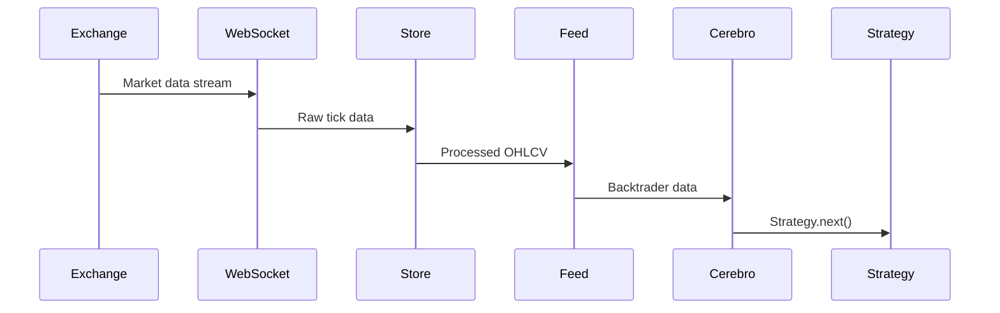
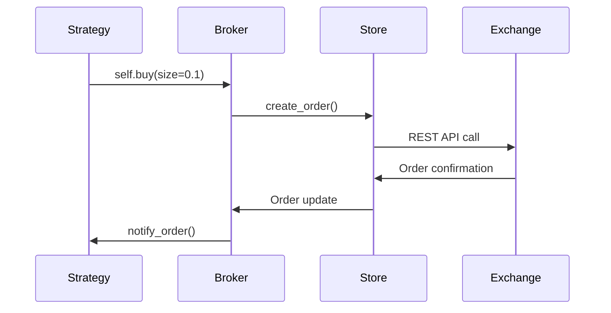

# Architecture Overview

Cracktrader's architecture is designed for **modularity**, **performance**, and **reliability** in cryptocurrency trading applications.

## High-Level Architecture



## Core Components

### 1. Cerebro Engine (Execution)

The **Cerebro** is Cracktrader's execution engine, inherited from Backtrader:

- **Strategy Orchestration**: Manages strategy lifecycle and execution
- **Data Flow**: Coordinates data between feeds, strategies, and brokers
- **Event Loop**: Handles tick-by-tick or bar-by-bar execution
- **Performance Tracking**: Collects metrics and runs analyzers

```python
cerebro = bt.Cerebro()
cerebro.adddata(data_feed)
cerebro.addstrategy(MyStrategy)
cerebro.setbroker(broker)
cerebro.run()
```

### 2. CCXT Store (Integration Hub)

The **CCXTStore** is the central integration point:

- **Exchange Abstraction**: Unified interface to 400+ exchanges
- **Connection Pooling**: Efficient WebSocket and REST connections
- **Data Caching**: Historical data storage and retrieval
- **Rate Limiting**: Automatic request throttling

```python
store = CCXTStore(
    exchange='binance',
    sandbox=True,
    cache_enabled=True
)
```

**Key Features:**
- Singleton pattern for resource efficiency
- Async/await support with background event loops
- Automatic reconnection and error recovery
- Comprehensive logging and monitoring

### 3. Data Feeds (Market Data)

**CCXTDataFeed** provides real-time and historical market data:

- **Multi-Timeframe**: 1s to 1M intervals supported
- **Live Streaming**: WebSocket feeds for real-time data
- **Historical Backfill**: Automatic data loading for backtests
- **Data Quality**: Built-in validation and gap detection

```python
feed = CCXTDataFeed(
    store=store,
    symbol='BTC/USDT',
    timeframe='1h',
    live=True
)
```

### 4. Brokers (Order Execution)

Multiple broker implementations for different trading modes:

#### CCXTLiveBroker
- Real exchange connectivity
- Live order placement and tracking
- Real-time position updates
- Commission and slippage modeling

#### CCXTBackBroker
- Historical backtesting
- Perfect execution simulation
- Configurable slippage models
- Performance optimization

#### CCXTPaperBroker
- Paper trading with live data
- Risk-free strategy testing
- Real market conditions simulation

### 5. Strategies (Trading Logic)

Built on Backtrader's strategy framework with enhancements:

```python
class MyStrategy(bt.Strategy):
    def __init__(self):
        self.sma = bt.indicators.SMA(period=20)

    def next(self):
        if self.data.close > self.sma:
            self.buy(size=0.1)
```

**Enhanced Features:**
- OCO (One-Cancels-Other) bracket orders
- Advanced risk management
- Real-time performance monitoring
- Multi-asset support

## Data Flow Architecture

### 1. Market Data Flow



### 2. Order Execution Flow



## Threading and Concurrency

Cracktrader uses a **hybrid async/sync** architecture:

### Main Thread (Synchronous)
- Backtrader strategy execution
- Indicator calculations
- Analyzer processing

### Background Threads (Asynchronous)
- WebSocket data streams
- REST API requests
- Order status monitoring
- Database operations

### Thread Safety
- Lock-free data structures where possible
- Atomic operations for critical sections
- Message queues for cross-thread communication

```python
# Thread-safe store operations
store = CCXTStore(exchange='binance')
await store.initialize()  # Async initialization

# Sync strategy access
class Strategy(bt.Strategy):
    def next(self):
        # This runs in main thread
        latest_price = self.data.close[0]
```

## Performance Optimizations

### 1. Data Caching
- **Historical Data**: Persistent storage with smart invalidation
- **Market Data**: In-memory LRU caches for recent data
- **Exchange Info**: Cached symbol information and trading rules

### 2. Connection Pooling
- **WebSocket Reuse**: Single connection per exchange
- **HTTP Session Pooling**: Persistent connections for REST calls
- **Rate Limit Management**: Token bucket algorithm

### 3. Memory Management
- **Circular Buffers**: Fixed-size data arrays for indicators
- **Lazy Loading**: Data loaded on-demand
- **Garbage Collection**: Explicit cleanup of unused objects

## Error Handling and Recovery

### 1. Connection Resilience
- **Automatic Reconnection**: Exponential backoff for failed connections
- **Heartbeat Monitoring**: Detect stale connections
- **Fallback Mechanisms**: Switch to backup data sources

### 2. Data Quality Assurance
- **Gap Detection**: Identify missing data points
- **Outlier Filtering**: Remove erroneous price data
- **Validation Checks**: Ensure data consistency

### 3. Order Safety
- **Pre-flight Checks**: Validate orders before submission
- **Status Monitoring**: Track order lifecycle
- **Failure Recovery**: Handle partial fills and rejections

## Configuration Management

### 1. Hierarchical Configuration
```
Environment Variables → Config Files → Code Defaults
```

### 2. Exchange-Specific Settings
```python
config = {
    'binance': {
        'sandbox': True,
        'rate_limit': 1200,  # requests per minute
        'timeout': 30000     # milliseconds
    }
}
```

### 3. Strategy Parameters
```python
class Strategy(bt.Strategy):
    params = (
        ('period', 20),
        ('risk_pct', 0.02),
    )
```

## Monitoring and Observability

### 1. Structured Logging
- **JSON Format**: Machine-readable logs
- **Context Propagation**: Request tracing across components
- **Log Levels**: Configurable verbosity

### 2. Metrics Collection
- **Performance Metrics**: Latency, throughput, error rates
- **Business Metrics**: PnL, win rate, Sharpe ratio
- **System Metrics**: Memory, CPU, network usage

### 3. Health Checks
- **Liveness Probes**: Is the system running?
- **Readiness Probes**: Can it handle requests?
- **Dependency Checks**: Are exchanges reachable?

## Next Steps

- [**Exchanges**](exchanges.md) - Exchange integration details
- [**Data Feeds**](feeds.md) - Market data handling
- [**Brokers**](brokers.md) - Order execution systems
- [**Strategies**](strategies.md) - Trading logic development
