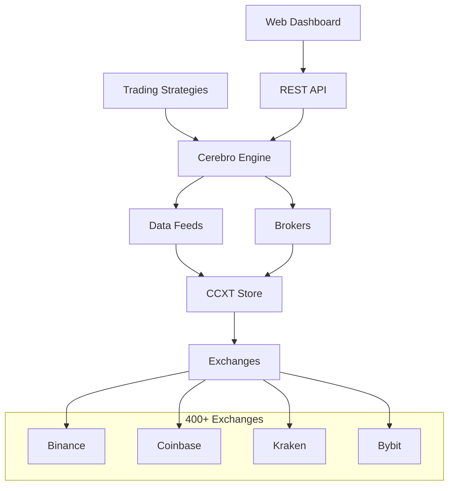

# CrackTrader

**Professional cryptocurrency trading framework bridging CCXT and Backtrader**

Connect to 400+ exchanges • Backtest with precision • Trade with confidence

---

## Why CrackTrader?

**For Traders & Quants** - Build, test, and deploy trading strategies across any cryptocurrency exchange with professional-grade tools.

**For Developers** - Modern async architecture with comprehensive testing, web API, and production-ready monitoring.

**For Teams** - Structured documentation, clear patterns, and maintainable code that scales from research to production.

## Key Benefits

🚀 **Fast Development** - Write strategies once, run on any exchange
📊 **Data-Rich** - Real-time WebSocket feeds + historical data caching
🧪 **Battle-Tested** - 2:1 test-to-source ratio with comprehensive test coverage
🌐 **Web-Enabled** - Built-in REST API and React dashboard
⚡ **High Performance** - Async architecture supporting sub-minute intervals

---

## Quick Start

### 1. Install

```bash
pip install git+https://github.com/LachlanBridges/cracktrader.git
```

### 2. Your First Strategy

```python
import backtrader as bt
from cracktrader import CCXTStore, CCXTDataFeed

class SimpleMovingAverage(bt.Strategy):
    def next(self):
        if not self.position and self.data.close[0] > self.sma[0]:
            self.buy()
        elif self.position and self.data.close[0] < self.sma[0]:
            self.sell()

# Connect to any exchange
store = CCXTStore(exchange='binance', cache_enabled=True)
data = CCXTDataFeed(store=store, symbol='BTC/USDT', timeframe='1h')

cerebro = bt.Cerebro()
cerebro.adddata(data)
cerebro.addstrategy(SimpleMovingAverage)
cerebro.run()
```

### 3. Trade Live

```python
# Switch to live trading
store = CCXTStore(exchange='binance', sandbox=False, api_key='...', secret='...')
```

**That's it!** Same strategy, live market execution.

---

## Documentation Structure

This documentation follows the **Diátaxis framework** - designed for both newcomers and power users:

### 🎯 Tutorials - **Learn by Doing**
Step-by-step learning path from installation to your first profitable strategy.

- **[Quickstart](getting_started/quickstart.md)** - Get trading in 5 minutes
- **[Installation](getting_started/installation.md)** - Complete setup guide
- **[First Strategy](getting_started/first_strategy.md)** - Build your first algorithm
- **[Basic Example](examples/basic_strategy.md)** - Real-world strategy patterns

### 🛠️ How-to Guides - **Task Recipes**
Solutions to specific problems and common tasks.

- **[Configure Platform](getting_started/configuration.md)** - All configuration options
- **[Strategy Cookbook](strategy_guide.md)** - Common patterns and techniques
- **[Use Web API](WEB_API.md)** - REST API and dashboard integration
- **[Backtrader Compatibility](integrations/backtrader_compat.md)** - Existing strategy migration

### 🧠 Explanations - **Understanding Concepts**
Deep dive into architecture and key concepts.

- **[Architecture](core_concepts/architecture.md)** - System design and data flow
- **[Strategies](core_concepts/strategies.md)** - Strategy patterns and lifecycle
- **[Data Feeds](core_concepts/feeds.md)** - Real-time and historical data
- **[Brokers](core_concepts/brokers.md)** - Order execution and position management
- **[Exchanges](core_concepts/exchanges.md)** - CCXT integration and exchange support
- **[Caching](core_concepts/caching.md)** - Performance optimization strategies

### 📚 Reference - **Quick Lookup**
Complete API and configuration reference.

- **[Web API Reference](reference/web_api.md)** - REST endpoints and WebSocket API
- **[Configuration Reference](reference/configuration.md)** - All settings and environment variables

### ⚡ Performance - **Scale & Optimize**
- **[Overview](performance/overview.md)** - Performance characteristics
- **[Caching Guide](performance/caching_guide.md)** - Data caching strategies
- **[Large Datasets](performance/large_datasets.md)** - Handling big data efficiently
- **[Benchmarking](performance/benchmarking.md)** - Performance measurement
- **[Optimization Roadmap](performance/optimization_roadmap.md)** - Future improvements

### 🧪 Testing & Quality - **Reliability**
- **[Strategy Analysis](testing/strategy_analysis.md)** - Testing trading strategies
- **[Test Fixtures](testing/fixture_strategy.md)** - Sample strategies for testing
- **[Mocking Policy](testing/mocking_policy.md)** - Test isolation strategies
- **[Coverage Status](testing/test_coverage.md)** - Current test coverage
- **[Known Gaps](testing/known_gaps.md)** - Areas needing improvement

### 🤝 Contributing - **Development Workflow**
- **[Overview](development/README.md)** - Getting started with development
- **[Workflow](development/workflow.md)** - Git workflow and code standards
- **[Testing Guidelines](development/testing_guidelines.md)** - How to write tests
- **[Publishing](development/publishing.md)** - Release and documentation process

---

## What Makes CrackTrader Different?

### 🔗 **True CCXT Integration**
Not just another wrapper - deep integration with CCXT for reliable exchange connectivity, unified symbol handling, and comprehensive order type support.

### 📈 **Backtrader Native**
100% compatible with existing Backtrader strategies and indicators. Migrate existing strategies with zero code changes.

### 🌐 **Production Web API**
Built-in FastAPI server with React dashboard. Monitor strategies, analyze performance, and manage trades through a professional web interface.

### ⚡ **Performance First**
Async architecture with WebSocket streaming, data caching, and sub-minute interval support. Built for high-frequency and algorithmic trading.

### 🧪 **Quality Assured**
Comprehensive test suite with 2:1 test-to-source ratio. Unit, integration, and end-to-end tests ensure reliability in production.

---

## Architecture Overview



**Data flows seamlessly** from exchanges through CCXT to your strategies, while the web API provides real-time monitoring and control.

---

## Ready to Start?

### New to Algorithmic Trading?
**→ [Quickstart Tutorial](getting_started/quickstart.md)** - Learn the basics with guided examples

### Experienced with Backtrader?
**→ [Migration Guide](integrations/backtrader_compat.md)** - Adapt existing strategies in minutes

### Building for Production?
**→ [Architecture Guide](core_concepts/architecture.md)** - Understand the system design

### Need API Integration?
**→ [Web API Reference](reference/web_api.md)** - Complete REST and WebSocket documentation

---

*Built with ❤️ for the cryptocurrency trading community*
