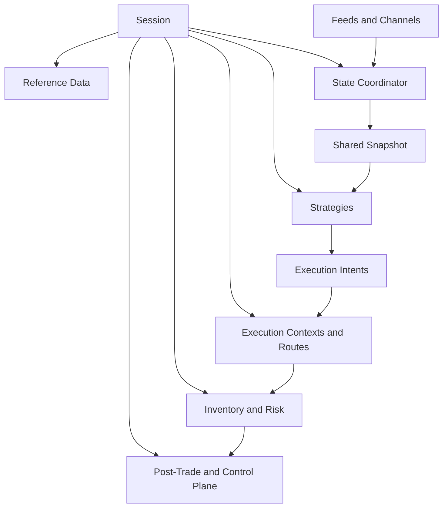

# Cracktrader Documentation

This docs site now treats the runtime architecture as the primary orientation layer.

If you are new to Cracktrader, or trying to re-ingest the repo after earlier Cerebro-centric docs, start with the architecture pages below before reading older concept pages.

## Read This First

1. [Architecture Index](architecture/agent_index.md)
2. [Runtime Map](architecture/runtime_map.md)
3. [Mode Matrix](architecture/mode_matrix.md)
4. [Runtime Terms](architecture/runtime_terms.md)

## Current Runtime Model

The preferred mental model is:

- a session owns shared runtime services
- market inputs update a shared state coordinator
- the runtime builds one immutable snapshot per step
- strategies consume filtered views of that snapshot
- strategies emit attributed intents against execution contexts and routes
- inventory, risk, execution adapters, and post-trade hooks handle the rest

Backtrader compatibility is still important, but it is no longer the right top-level map for the system.

## Where To Go Next

| Goal | Start here |
| --- | --- |
| Understand the current architecture quickly | [Architecture Index](architecture/agent_index.md) |
| See the runtime boundaries end to end | [Runtime Map](architecture/runtime_map.md) |
| Compare backtest, paper, sandbox, and live behavior | [Mode Matrix](architecture/mode_matrix.md) |
| Look up stable runtime vocabulary | [Runtime Terms](architecture/runtime_terms.md) |
| Follow legacy links or older mental models safely | [Legacy Architecture Context](core_concepts/architecture.md) |
| Install and run your first example | [Getting Started](getting_started/installation.md) |
| Find stable user-facing APIs | [Reference](reference/entry_points.md) |

## Runtime Overview

```mermaid
graph TD
    A["Session"] --> B["Reference Data"]
    A --> C["State Coordinator"]
    A --> D["Strategies"]
    A --> E["Execution Contexts and Routes"]
    A --> F["Inventory and Risk"]
    A --> G["Post-Trade and Control Plane"]
    H["Feeds and Channels"] --> C
    C --> I["Shared Snapshot"]
    I --> D
    D --> J["Execution Intents"]
    J --> E
    E --> F
    F --> G
```

## Compatibility Note

Older pages about feeds, brokers, stores, and Cerebro are still available because they remain useful for implementation detail and migration work.

Use them as secondary detail, not as the primary runtime truth.
