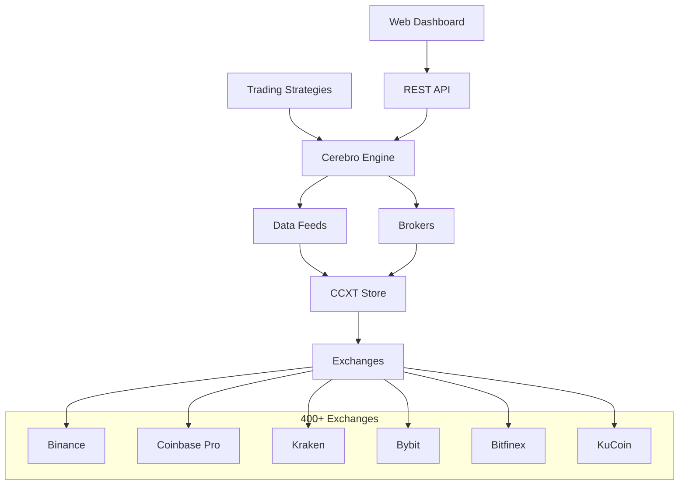

# CrackTrader

Professional cryptocurrency trading framework for algorithmic traders and quantitative analysts

Trade across 400+ exchanges. Backtest with precision. Deploy with confidence.

---

## Overview

CrackTrader provides a unified platform to build, test, and deploy algorithmic trading strategies across 400+ cryptocurrency exchanges with seamless Backtrader integration. Built for professional traders who demand execution quality, data integrity, and reproducible results.

## Key Features

- **Universal Exchange Access**: Trade on 400+ exchanges through a single, unified interface
- **Real-Time Data Streams**: WebSocket feeds with historical backfill and intelligent caching
- **Production Ready**: Comprehensive testing, robust error handling, and proven reliability
- **Web Dashboard**: REST API with real-time monitoring and control interface
- **High Performance**: Asynchronous architecture supporting sub-minute timeframes

---

## Quick Start

### 1. Install

```bash
pip install git+https://github.com/cracktrader/cracktrader.git
```

### 2. Your First Strategy (backtest)

```python
import cracktrader as ct

class SimpleMovingAverage(ct.bt.Strategy):
    def __init__(self):
        self.sma = ct.indicators.SMA(self.data.close, period=20)

    def next(self):
        if not self.position and self.data.close[0] > self.sma[0]:
            self.buy()
        elif self.position and self.data.close[0] < self.sma[0]:
            self.sell()

# Connect to exchange
store = ct.CCXTStore(exchange='binance', cache_enabled=True)
data = ct.CCXTDataFeed(store=store, symbol='BTC/USDT', timeframe='1h')

cerebro = ct.Cerebro()
cerebro.adddata(data)
cerebro.addstrategy(SimpleMovingAverage)
cerebro.run()
```

### 3. Go Live (when ready)

```python
# Switch to live trading
store = ct.CCXTStore(
    exchange='binance',
    sandbox=False,
    config={'apiKey': '...', 'secret': '...'}
)
```

Use the built-in backtesting broker for strategy development. Switch to `CCXTLiveBroker` for live execution. The store automatically manages connections and ensures data consistency across components.

---

## Navigation

Use the navigation tabs above or explore key sections:

**🚀 [Getting Started](getting_started/installation.md)** - Installation, configuration, and your first strategy  
**🧠 [Understanding Cracktrader](core_concepts/architecture.md)** - Core concepts and system architecture  
**📈 [Strategy Tutorials](tutorials/multi_exchange.md)** - Advanced trading strategies and techniques  
**📚 [Reference](reference/core_classes.md)** - Complete API documentation and indicators  
**⚡ [Developers](testing/tested_exchanges.md)** - Testing, performance, and support resources

---

## For Professional Traders

- **Multi-Exchange Trading**: Unified interface across 400+ exchanges with consistent symbol mapping
- **Strategy Migration**: Run existing Backtrader strategies with minimal modifications
- **Real-Time Monitoring**: FastAPI-powered dashboard with WebSocket streams and REST controls
- **High-Frequency Capable**: Asynchronous data pipeline supporting sub-minute timeframes
- **Enterprise Quality**: Comprehensive test coverage with unit, integration, and end-to-end validation

---

## Architecture Overview


```mermaid
graph TB
    A[Trading Strategies] --> B[Cerebro Engine]
    B --> C[Data Feeds]
    B --> D[Brokers]
    C --> E[CCXT Store]
    D --> E
    E --> F[Exchanges]

    G[Web Dashboard] --> H[REST API]
    H --> B

    subgraph "400+ Exchanges"
        F1[Binance]
        F2[Coinbase Pro]
        F3[Kraken]
        F4[Bybit]
        F5[Bitfinex]
        F6[KuCoin]
    end

    F --> F1
    F --> F2
    F --> F3
    F --> F4
    F --> F5
    F --> F6
```

Data flows from exchanges through the unified interface to your strategies. The web API provides real-time monitoring and control. See [Performance](performance/overview.md) for current characteristics and benchmarks.

---

## Ready to Start?

### 🆕 New to Algorithmic Trading?
Start with our [**Quickstart Guide**](getting_started/quickstart.md) - Learn the fundamentals with step-by-step examples

### 📊 Experienced with Backtrader?  
Check out [**Strategy Migration**](core_concepts/strategies.md) - Adapt existing strategies with minimal changes

### 🏗️ Building for Production?
Review our [**Architecture Overview**](core_concepts/architecture.md) - Understand the system design and best practices

### 🔌 Need API Integration?
Explore the [**Web API Reference**](reference/web_api.md) - Complete REST and WebSocket documentation

---
